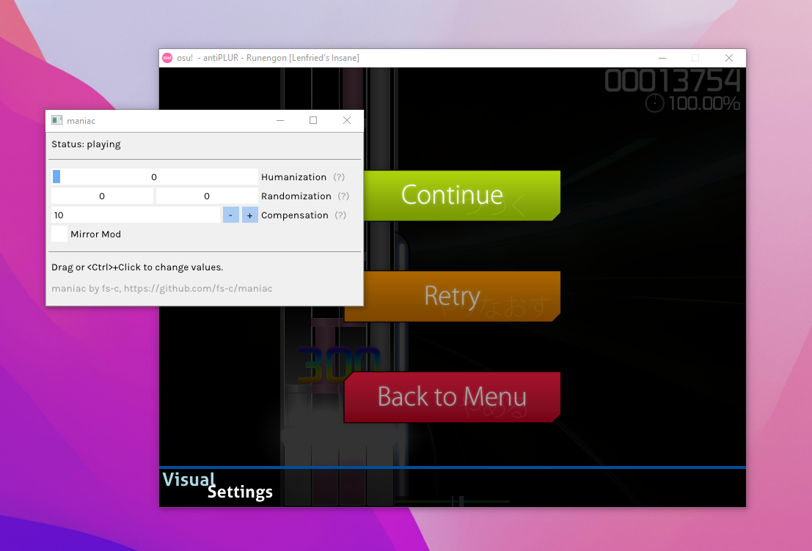

<h2 align="center">maniac</h2>

<p align="center">
  Simple external cheat for <a href="https://osu.ppy.sh/help/wiki/Game_Modes/osu!mania">osu!mania</a>.<br>
</p>



Join the [Discord server](https://discord.gg/aARF7KbTuj), if that's your thing.

## Usage

https://user-images.githubusercontent.com/28566392/163677800-b3087fe0-d7f7-46cd-9645-dc1f0f88ad67.mp4

1. Download the latest build from the [releases tab](https://github.com/fs-c/maniac/releases). (Don't use the `-debug` version unless you are encountering issues and want debug information.)
2. Start osu. You might get a pop-up with a title like "Windows protected your PC". This is a false positive, just click "More info" and "Run anyway".
3. Start maniac.

Maniac will now automatically play any beatmap you open in osu.

## Contact

The preferred ways for getting in touch with me are 
- [opening an issue](https://github.com/fs-c/maniac/issues) on GitHub
- joining the [Discord](https://discord.gg/aARF7KbTuj) server

If you have encountered bugs or have a feature request, GitHub issues are usually best. For general questions or if you just want to get in touch please use Discord.

I'd prefer if you didn't send me emails regarding maniac, please just use one of the platforms above. Thanks.

## Building

_The following is only relevant to developers looking to build the project from source. This is not usually something done by regular users who are advised to [download the automatically built binaries](https://github.com/fs-c/maniac/releases) instead._

```
# Get the code
git clone https://github.com/fs-c/maniac.git

# Building out-of-source is preferred
mkdir build
cd build

# Generate build files from the CMakeLists file in the parent directory
# Other generators should work as well too, but this is the supported one
cmake .. -G "Visual Studio 17 2022" -A Win32
# OR, if you want a release build
cmake .. -G "Visual Studio 17 2022" -A Win32 -DCMAKE_BUILD_TYPE="Release"

# Run the build
cmake --build . -- /p:Configuration=Debug
# OR, if you specified "Release" earlier
cmake --build . -- /p:Configuration=Release
```

For an example see the CI build steps in `.github/workflows`. __Make sure to use Win32 or equivalent, maniac expects certain (implementation/architecture dependent) type sizes!__

`Release` builds are optimized and don't contain debug information, unlike `Debug` builds which also have significantly more verbose logging.

## Library

_The following is only relevant to developers looking to use parts of the maniac codebase in their own projects. If none of this means anything to you, you can safely ignore this section._

You may have noticed that `maniac` consists of two parts: a library (`lib`) and the GUI application (`app`). Assuming you are using CMake, when including this project with `add_subdirectory` only the library will be built.

I doubt that anyone will come to use the library and I mostly separated it out because it was convenient for another related project. Therefore no proper documentation is provided, sorry. I recommend reading the header files in `lib/include/maniac` for an overview of the available functionality and to consult `app/app.cpp` for example usage.

Of course please also feel free to open an issue for any questions you may have.

## Thanks

- n0b453c0d3r on UC and [mrflashstudio](https://github.com/mrflashstudio) for
  providing up to date signatures and offsets
- [ocornut](https://github.com/ocornut) for the [imgui](https://github.com/ocornut/imgui) library
- to everyone who reported bugs and provided feedback
